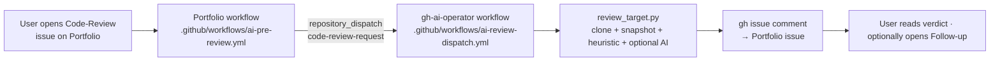

# ARC GitHub AI Operator

[](https://github.com/GareBear99/gh-ai-operator/actions/workflows/ci.yml)
[](LICENSE)
[](https://www.python.org/)
[](https://github.com/GareBear99/ARC-Core)

> **Evidence-first GitHub scout + single-target code reviewer** for the ARC
> ecosystem. Discovers related repositories, clones them one at a time,
> collects a structural snapshot, runs an AI (or heuristic) review, and either
> writes a local report or posts a verdict comment back to the Portfolio.

The operator ships two entry points:

| Entry point | What it does |
|---|---|
| `scout.py` | Seed-driven discovery of related public repos + batch review + draft/approval-queue issue output. |
| `review_target.py` | **Single-URL review.** Called by the Portfolio's code-review dispatch workflow. Takes one GitHub URL, posts a pre-review verdict back to the originating issue. |

## Safety posture

Default posture is safe:
- `posting.enabled = false`
- `posting.draft_only = true`
- confidence threshold + evidence gate + allowlist / denylist + duplicate-title / body checks + cooldown history + per-run and per-day caps.

The single-target `review_target.py` never auto-creates new issues anywhere; it only **comments** on the specific Portfolio issue you pass to it.

## How the Portfolio dispatch flow works



The workflow also runs standalone via **workflow_dispatch** — trigger it manually from the Actions tab with a `target_url` + optional `portfolio_issue`.

## Install

```bash
python3 -m venv .venv
source .venv/bin/activate
pip install -e ./github_ai_operator[dev]
export GITHUB_TOKEN="$(gh auth token)"
```

This exposes two console scripts:

- `arc-operator-scout`  — seed-driven discovery.
- `arc-operator-review` — single-target review.

## Quickstart: single-target review

```bash
arc-operator-review \
  --target https://github.com/octocat/Hello-World \
  --review-type "Full repo review" \
  --depth standard \
  --focus "Check README, license, and tests"
```

Writes `github_ai_operator/output/target_review/<slug>.md`.

Pass `--portfolio-issue GareBear99/Portfolio#123` to also **comment the review on that issue** (requires a token with `issues:write` on the Portfolio repo).

## Quickstart: scout mode

```bash
cd github_ai_operator
cp config.example.json config.json
python scout.py --config config.json --print-queries --dry-run
python scout.py --config config.json    # draft mode
```

## Configuration

See `github_ai_operator/config.example.json`. Key sections:

- `seed_repos` — which repos to learn keywords from.
- `search` — `mode: related | custom | hybrid`, `min_stars`, `languages`, `required_topics`, `pushed_after`.
- `limits` — `max_repos_per_run`, `max_issue_posts_per_day`, `min_similarity_score`, `min_issue_confidence`, `repost_cooldown_days`, `duplicate_title_overlap_threshold`.
- `posting` — `enabled`, `draft_only`, `require_manual_approval`, `allowlist`, `denylist`, `labels`.
- `ai` — optional LLM backend (`api_url`, `api_key_env`, `model`). Falls back to heuristic review if no AI is configured.

## Tests

```bash
cd github_ai_operator
pip install pytest
python -m pytest tests/ -q
```

Tests cover the parts the Portfolio dispatch flow depends on: config loading, URL parsing, verdict derivation, markdown rendering.

## GitHub Actions workflows

- **`.github/workflows/ci.yml`** — runs pytest on every push / PR across Python 3.10 / 3.11 / 3.12, plus a smoke dry-run of the scout.
- **`.github/workflows/ai-review-dispatch.yml`** — listens for `repository_dispatch` of type `code-review-request` from the Portfolio, runs the single-target review, and comments the verdict back on the originating Portfolio issue. Also exposed as a `workflow_dispatch` so it can be triggered manually from the Actions tab.

### Required secret for cross-repo commenting

To post reviews back to Portfolio issues, set a PAT with `issues:write` on `GareBear99/Portfolio` as the **`PORTFOLIO_WRITE_TOKEN`** secret in this repo (Settings → Secrets and variables → Actions). The workflow prefers it over the built-in `GITHUB_TOKEN`, which is scoped to this repo only.

## Project layout

```text
gh-ai-operator/
├── .github/
│   ├── FUNDING.yml
│   └── workflows/
│       ├── ci.yml
│       └── ai-review-dispatch.yml
└── github_ai_operator/
    ├── github_ai_operator/
    │   ├── __init__.py
    │   ├── ai_client.py
    │   ├── anthropic_client.py
    │   ├── config.py
    │   ├── delay.py
    │   ├── engine.py
    │   ├── free_llm_client.py
    │   ├── github_api.py
    │   ├── issue_writer.py
    │   ├── models.py
    │   ├── review.py
    │   └── similarity.py
    ├── tests/
    │   └── test_basic.py
    ├── config.example.json
    ├── pyproject.toml
    ├── requirements.txt
    ├── review_target.py
    └── scout.py
```

## Current limits

This is **not** a full semantic code auditor. It works best as:

- a scout,
- a triage assistant,
- a first-pass reviewer on a URL,
- a manual-review accelerator.

It does **not** run CI, execute tests inside target repos, or guarantee correctness of AI-generated review text. Use it as a pre-review gate, not a human replacement.

## 💖 Support

- [GitHub Sponsors](https://github.com/sponsors/GareBear99)
- [Buy Me a Coffee](https://www.buymeacoffee.com/garebear99)
- [Ko-fi](https://ko-fi.com/garebear99)

## Related ARC repos

- [ARC-Core](https://github.com/GareBear99/ARC-Core) — event + receipt spine.
- [Portfolio](https://github.com/GareBear99/Portfolio) — the consumer of this operator's pre-review flow.
- [omnibinary-runtime](https://github.com/GareBear99/omnibinary-runtime) + [Arc-RAR](https://github.com/GareBear99/Arc-RAR) — any-OS portability.

## License

MIT — see the project LICENSE file.
